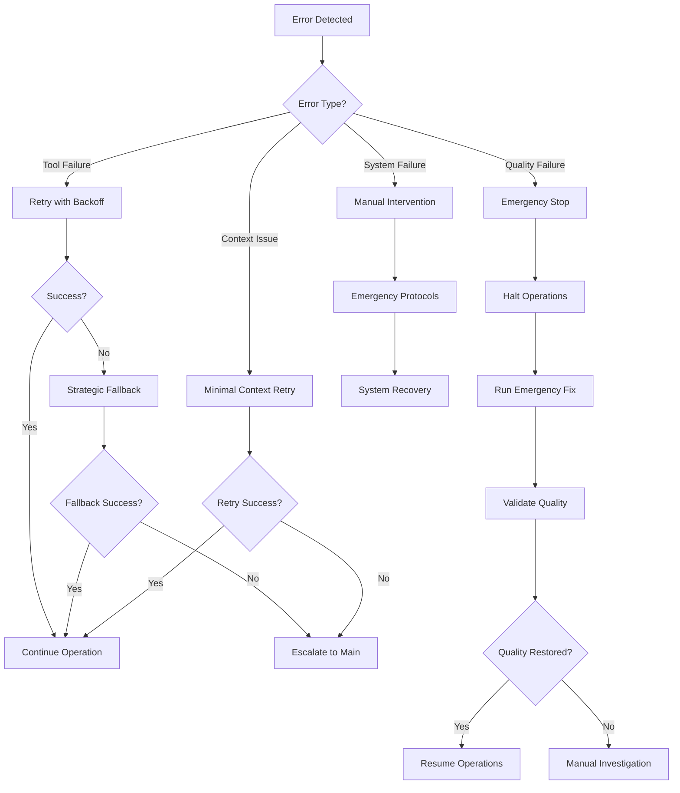

# Sub-Agent Error Handling and Recovery System

## Overview

Comprehensive error handling and recovery mechanisms for sub-agent operations, ensuring graceful degradation, state preservation, and framework compliance during failures.

## Error Classification Matrix

### Level 1: Tool Failures (Recoverable)

```yaml
mcp_tool_failures:
  severity: low_to_medium
  impact: workflow_delay
  recovery: automatic_fallback
  
  scenarios:
    - mcp_git_limitation: fallback_to_bash_git
    - mcp_tool_unavailable: strategic_bash_usage
    - mcp_timeout: retry_with_backoff
    - mcp_permission_error: escalate_to_main
  
  handling:
    max_retries: 3
    backoff_strategy: exponential
    fallback_threshold: 5_percent_bash_usage
    documentation_required: true
```

### Level 2: Context Transfer Failures (Manageable)

```yaml
context_failures:
  severity: medium
  impact: sub_agent_restart
  recovery: minimal_context_retry
  
  scenarios:
    - context_too_large: compress_critical_only
    - context_corruption: restore_from_taskmaster
    - missing_critical_data: request_from_main
    - token_limit_exceeded: prioritize_essential
  
  handling:
    retry_strategy: minimal_context
    max_attempts: 2
    escalation: return_to_main_context
    state_preservation: taskmaster_backup
```

### Level 3: Quality Gate Failures (Critical)

```yaml
quality_failures:
  severity: high
  impact: workflow_halt
  recovery: mandatory_stop_and_fix
  
  scenarios:
    - test_failures: immediate_investigation
    - lint_violations: emergency_fix_script
    - ci_pipeline_red: systematic_resolution
    - security_vulnerabilities: escalate_immediately
  
  handling:
    stop_policy: immediate
    investigation: root_cause_analysis
    fix_requirement: systematic_before_proceed
    quality_validation: complete_recheck
```

### Level 4: System Failures (Emergency)

```yaml
system_failures:
  severity: critical
  impact: framework_integrity
  recovery: emergency_protocols
  
  scenarios:
    - taskmaster_corruption: restore_from_backup
    - framework_compliance_violation: audit_and_fix
    - circular_dependencies: dependency_graph_repair
    - project_state_corruption: manual_recovery
  
  handling:
    emergency_stop: immediate
    isolation: affected_components
    recovery_team: manual_intervention
    validation: complete_system_check
```

## Recovery Mechanisms

### 1. Graceful Degradation Protocol

```typescript
interface GracefulDegradation {
  // MCP tool failure handling
  async handleMcpFailure(
    tool: string,
    operation: string,
    context: SubAgentContext
  ): Promise<RecoveryResult> {
    
    // Log failure for tracking
    await logMcpFailure(tool, operation, context)
    
    // Attempt strategic Bash fallback (5% allowance)
    if (hasStrategicBashFallback(operation)) {
      return await executeStrategicBash(operation, context)
    }
    
    // Document limitation for future improvement
    await documentMcpLimitation(tool, operation)
    
    // Escalate to main context
    return escalateToMain(`MCP tool ${tool} failed for ${operation}`)
  }
  
  // Context transfer failure handling
  async handleContextFailure(
    transferType: 'to_agent' | 'from_agent',
    context: SubAgentContext
  ): Promise<RecoveryResult> {
    
    // Compress to critical context only
    const minimalContext = extractCriticalContext(context)
    
    // Retry with minimal context
    if (minimalContext.size < MAX_CRITICAL_CONTEXT_SIZE) {
      return await retryWithMinimalContext(minimalContext)
    }
    
    // Return to main context with state preservation
    await preserveStateInTaskMaster(context)
    return escalateToMain('Context transfer failed, state preserved')
  }
}
```

### 2. State Preservation System

```typescript
interface StatePreservation {
  // Backup before risky operations
  async createStateCheckpoint(
    agentType: string,
    taskId: string,
    context: SubAgentContext
  ): Promise<CheckpointId> {
    
    const checkpoint = {
      timestamp: new Date(),
      agentType,
      taskId,
      taskMasterState: await captureTaskMasterState(),
      qualityStatus: await captureQualityStatus(),
      projectState: await captureProjectState(),
      context: sanitizeContext(context)
    }
    
    return await storeCheckpoint(checkpoint)
  }
  
  // Restore from checkpoint on failure
  async restoreFromCheckpoint(
    checkpointId: CheckpointId
  ): Promise<void> {
    
    const checkpoint = await loadCheckpoint(checkpointId)
    
    // Restore TaskMaster state
    await restoreTaskMasterState(checkpoint.taskMasterState)
    
    // Restore project files if needed
    if (checkpoint.projectState.hasFileChanges) {
      await restoreProjectFiles(checkpoint.projectState)
    }
    
    // Validate restoration
    await validateStateConsistency()
  }
}
```

### 3. Quality Recovery Protocol

```typescript
interface QualityRecovery {
  // Emergency quality fix execution
  async executeEmergencyFix(
    qualityFailure: QualityFailureType
  ): Promise<FixResult> {
    
    switch (qualityFailure) {
      case 'lint_violations':
        return await executeLintFix()
      
      case 'test_failures':
        return await investigateTestFailures()
      
      case 'ci_pipeline_failure':
        return await diagnoseCiFailure()
      
      case 'security_vulnerability':
        return await escalateSecurityIssue()
    }
  }
  
  // Systematic quality restoration
  async restoreQualityCompliance(): Promise<void> {
    // Stop all sub-agent operations
    await haltAllSubAgents()
    
    // Run comprehensive quality check
    const qualityStatus = await runCompleteQualityCheck()
    
    if (!qualityStatus.passing) {
      // Execute emergency fix scripts
      await executeFixScript('scripts/fix-lint-violations.sh')
      
      // Re-run quality checks
      await validateQualityRestoration()
    }
    
    // Resume operations only after quality passes
    await resumeSubAgentOperations()
  }
}
```

## Error Escalation Matrix

### Escalation Levels

```yaml
level_1_auto_recovery:
  trigger: tool_timeout, minor_mcp_failure
  action: retry_with_backoff
  max_attempts: 3
  escalation_delay: 30_seconds
  
level_2_fallback_strategy:
  trigger: persistent_mcp_failure, context_size_limit
  action: strategic_bash_fallback, minimal_context
  max_attempts: 2
  escalation_delay: 60_seconds
  
level_3_main_context_return:
  trigger: multiple_fallback_failures, critical_context_loss
  action: preserve_state_and_escalate
  max_attempts: 1
  escalation_delay: immediate
  
level_4_emergency_stop:
  trigger: quality_gate_failure, system_corruption
  action: halt_all_operations, manual_intervention
  max_attempts: 0
  escalation_delay: immediate
```

### Escalation Decision Tree



## Recovery Validation

### Post-Recovery Verification

```yaml
verification_checklist:
  framework_compliance:
    - [ ] MCP usage ratio < 95%
    - [ ] Quality gates passing
    - [ ] TaskMaster sync intact
    - [ ] PIXI-only dependencies
  
  system_integrity:
    - [ ] No circular dependencies
    - [ ] Task state consistency
    - [ ] File system integrity
    - [ ] Git repository clean
  
  quality_standards:
    - [ ] All tests passing
    - [ ] Zero critical lint violations
    - [ ] CI pipeline green
    - [ ] Security scan clean
  
  operational_readiness:
    - [ ] Sub-agents responsive
    - [ ] Context transfer working
    - [ ] Error handling active
    - [ ] Monitoring functional
```

### Recovery Success Metrics

```yaml
success_metrics:
  recovery_time:
    target: < 2_minutes
    measurement: error_detection_to_normal_operation
    
  data_integrity:
    target: 100_percent
    measurement: no_data_loss_during_recovery
    
  quality_maintenance:
    target: zero_degradation
    measurement: quality_gates_remain_passing
    
  user_impact:
    target: minimal_disruption
    measurement: workflow_continuation_capability
```

## Implementation Guidelines

### Sub-Agent Error Handling Integration

```typescript
// Required error handling for all sub-agents
abstract class SubAgentBase {
  protected async executeWithErrorHandling<T>(
    operation: () => Promise<T>,
    context: SubAgentContext
  ): Promise<T> {
    
    const checkpointId = await this.createCheckpoint(context)
    
    try {
      const result = await operation()
      await this.validateResult(result)
      return result
      
    } catch (error) {
      await this.handleError(error, context, checkpointId)
      throw error
    }
  }
  
  protected abstract async handleError(
    error: Error,
    context: SubAgentContext,
    checkpointId: CheckpointId
  ): Promise<void>
}
```

### Quality Gate Integration

```bash
# Mandatory error-safe quality validation
error_safe_quality_check() {
  # Create pre-check backup
  local backup_id=$(create_quality_checkpoint)
  
  # Run quality checks with error capture
  if ! pixi run quality 2>&1 | tee quality_check.log; then
    echo "Quality check failed - initiating recovery"
    
    # Execute emergency fix
    if [[ -f "scripts/fix-lint-violations.sh" ]]; then
      ./scripts/fix-lint-violations.sh
    fi
    
    # Retry quality check
    if ! pixi run quality; then
      echo "Emergency fix failed - escalating to manual intervention"
      restore_from_checkpoint "$backup_id"
      exit 1
    fi
  fi
  
  # Cleanup backup on success
  cleanup_checkpoint "$backup_id"
}
```

This error handling and recovery system ensures sub-agent operations maintain framework compliance and quality standards even during failures, with clear escalation paths and state preservation mechanisms.